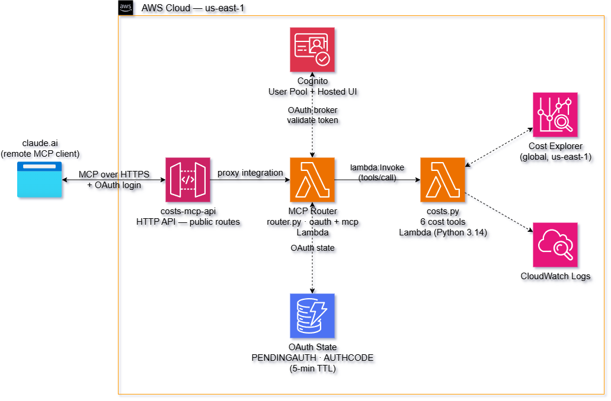

# AWS Cognito MCP — Cost Explorer Connector

This project delivers a **remote MCP (Model Context Protocol) connector** on AWS
that lets Claude query AWS costs in plain English — secured with **Amazon Cognito
OAuth 2.0**. Claude connects **directly** to a remote `https://…/mcp` endpoint,
signs the user in through Cognito's Hosted UI, and calls the cost tools.

**There is no local proxy, no SigV4 signing, and no API keys to distribute.**

It uses **Terraform** and **Python (boto3)** to provision and deploy the backend.
The only thing a user does is paste one URL into their MCP client.

> This is the Cognito port of [`aws-serverless-mcp`](https://github.com/mamonaco1973/aws-serverless-mcp),
> which secured the API with AWS IAM and required a local SigV4-signing proxy
> script. The OAuth authorization-server proxy pattern is the key enabler for
> going proxy-free.




## How it works

An **API Gateway HTTP API** fronts a single **router Lambda**. Every route is
public at the gateway — authentication is enforced inside the Lambda:

1. **Discovery** — Claude fetches `GET /.well-known/oauth-authorization-server`
   and learns this API is its OAuth authorization server.
2. **Registration** — Claude self-registers via `POST /oauth/register` (RFC 7591)
   and receives the shared MCP `client_id`.
3. **Login** — Claude opens `GET /authorize`; the Lambda redirects the browser to
   Cognito's Hosted UI. After the user signs in, Cognito calls back to
   `GET /oauth/callback`.
4. **Token** — Claude exchanges a one-time code at `POST /oauth/token` for a real
   Cognito access token.
5. **Use** — Claude calls `POST /mcp` with `Authorization: Bearer <token>`. The
   Lambda validates the token via Cognito's `/oauth2/userInfo` endpoint, then
   invokes the appropriate cost Lambda.

### Why an OAuth proxy?

claude.ai uses a dynamic `redirect_uri` containing its org ID, which Cognito's
exact-match allow-list rejects. `oauth.py` solves this by advertising **our API**
as the authorization server, registering only our fixed `/oauth/callback` with
Cognito, and brokering the flow — handing Claude a genuine Cognito access token
without Cognito ever seeing claude.ai's URL.

Key capabilities demonstrated:

1. **Remote MCP over OAuth** — Claude connects to the remote endpoint natively;
   no local runtime on the caller's machine.
2. **Cognito-secured** — every `/mcp` call carries a validated Cognito access
   token tied to a real user account.
3. **Authorization-server proxy** — `oauth.py` implements RFC 8414 metadata, RFC
   7591 dynamic registration, and the full authorize→callback→token flow.
4. **Least-privilege fan-out** — the router holds only `lambda:InvokeFunction` on
   the seven cost Lambdas; each cost Lambda keeps its own scoped Cost Explorer
   role.
5. **Infrastructure as Code** — Terraform provisions Lambdas, Cognito, DynamoDB,
   IAM, and API Gateway in a single apply.

## Prerequisites

* [An AWS Account](https://aws.amazon.com/console/) with Cost Explorer enabled
  (Billing console → Cost Explorer → Enable)
* [AWS CLI](https://docs.aws.amazon.com/cli/latest/userguide/getting-started-install.html)
* [Terraform](https://developer.hashicorp.com/terraform/install)
* `jq` in PATH (used by `apply.sh` / `validate.sh`)
* An MCP client that supports remote connectors with OAuth (claude.ai custom
  connectors, or Claude Desktop with a remote server URL)

## Download

```bash
git clone https://github.com/mamonaco1973/aws-cognito-mcp.git
cd aws-cognito-mcp
```

## Deploy

```bash
# Optional: seed a ready-to-use login (otherwise create a user manually, below)
export TF_VAR_test_user_email="you@example.com"
export TF_VAR_test_user_password="ChangeMe-Str0ng!"

./apply.sh
```

`apply.sh`:
1. `check_env.sh` — validates tools and AWS credentials.
2. `terraform apply` in `01-lambdas/` — deploys the six cost Lambdas, the router
   Lambda, Cognito (user pool + Hosted UI + MCP client), the OAuth state table,
   and the HTTP API.
3. `validate.sh` — direct-invokes each cost Lambda to confirm Cost Explorer
   connectivity.
4. Prints the **connector URL** and how to add it to Claude.

### Connect Claude

1. In claude.ai: **Settings → Connectors → Add custom connector**.
2. Paste the printed URL (`https://<api-id>.execute-api.us-east-1.amazonaws.com/mcp`).
3. Click **Connect**. On the Cognito page, new users click **Sign up** to
   self-register (email verification), then sign in — the six cost tools appear.

> **Self-signup is open by default.** Anyone who can reach the connector URL can
> register and read your AWS cost data. Keep the endpoint private, or lock it
> down: add a Cognito **pre-sign-up Lambda trigger** to allowlist email domains,
> or set `allow_admin_create_user_only = true` in `cognito.tf` for admin-only
> provisioning.

### Pre-create a user (instead of self-signup)

```bash
POOL=$(cd 01-lambdas && terraform output -raw cognito_user_pool_id)

aws cognito-idp admin-create-user \
  --user-pool-id "$POOL" \
  --username you@example.com \
  --user-attributes Name=email,Value=you@example.com Name=email_verified,Value=true

aws cognito-idp admin-set-user-password \
  --user-pool-id "$POOL" \
  --username you@example.com \
  --password 'YourPassw0rd!' --permanent
```

## Teardown

```bash
./destroy.sh
```

---

## MCP Tools

All six tools take no input and return plain-text summaries suitable for direct
narration.

| Tool | Backing Lambda | Description |
|------|----------------|-------------|
| `get_month_to_date_cost` | `cost-mtd` | Total AWS spend from the 1st of this month through today |
| `get_cost_by_service` | `cost-by-service` | MTD spend broken down by service, sorted descending |
| `compare_this_month_to_last_month` | `cost-compare` | This month MTD vs last month full total |
| `get_daily_cost_trend` | `cost-daily` | Day-by-day spend for the current month with running totals |
| `find_top_cost_drivers` | `cost-top-drivers` | Top 10 services by spend with percentage share |
| `forecast_month_end_cost` | `cost-forecast` | Projected remaining spend through end of month (80% CI) |

`tools/list` is served from `TOOL_REGISTRY` in `costs.py` (the single source of
truth), fetched by the router from the `cost-tools` Lambda.

### Example responses

**`get_month_to_date_cost`**
```
Month-to-date AWS cost (2026-04-01 through 2026-04-27): $142.38 USD
```

**`find_top_cost_drivers`**
```
Top AWS cost drivers (2026-04-01 through 2026-04-27):
   1. Amazon EC2: $87.14 (61.2% of total)
   2. Amazon RDS: $31.20 (21.9% of total)
   ...
  Total across all services: $142.38
```

---

## HTTP surface

| Endpoint | Method | Auth | Purpose |
|----------|--------|------|---------|
| `/.well-known/oauth-authorization-server` | GET | public | RFC 8414 metadata |
| `/oauth/register` | POST | public | RFC 7591 dynamic registration |
| `/authorize` | GET | public | Start Cognito login |
| `/oauth/callback` | GET | public | Cognito redirect target |
| `/oauth/token` | POST | public | Exchange code → Cognito access token |
| `/mcp` | POST | **Bearer (Cognito)** | MCP JSON-RPC |

The OAuth endpoints are public because they *are* the authentication; `/mcp`
validates the Bearer token inside the Lambda.
